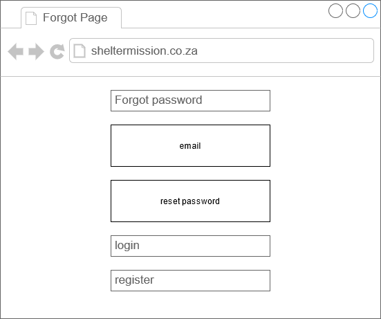

# Shelter Mission

# dsw-semester-project

---

# Group Members

Tiiso Senosha - 220003917 - theotiiso@gmail.com

Lesego Temane - 219081209 - lesegogtemane@gmail.com

Waaiez Kinnear - 219021671 - waaiez.kinnear10@gmail.com

Alexis Makgeru - 220042401 - sebotsealexis@gmail.com

Bonginkosi Nhantumbo - 217040604 - bonginkosi.li73@gmail.com

Blessing Leso - 219089394 - blessingitlotlengleso@gmail.com

# Group Member Tasks

Tiiso Senosha - Backend: Admin Login, Forgot Password, Login and Register. Frontend: Index View and Documentation

Lesego Temane - Backend: Database Creation. Frontend: Index View and Documentation

Waaiez Kinnear - Backend: Map Login and Admin Logic. Frontend: Index, Map and Admin Views and Documentation

Alexis Makgeru - Backend: Database Creation. Frontend: Index View and Documentation

Bonginkosi Nhantumbo - Frontend: Index, Error, Forgot Password, Login and Register Views and Documentation

Blessing Leso - Frontend: Index, Donate and Information Views and Documentation

# How to install

First you need NodeJS and MySQL installed.

Once installed and working you can clone this repo with the following command
`git clone https://github.com/Making-Updates/dsw-semester-project.git`

After the repo has been cloned you need to open a terminal window (Powershell) inside the folder and run the following command
`npm install`

This will install all the required dependencies.

After the dependencies are installed you need to create the database that is going to be used.
All the commands used can be found in `create_database.sql`

After the database and all its tables have been created you are ready to start using the website.

To make life easier we've included a `insert_mock_data.sql` file to insert mock data to get you up and running quicker.

Run the following command to start the website
`npm start`

Look in your terminal output and you will see the line
`Listening on Port XXXX`
Where `XXXX` is a number.

Once you have the Port number you can navigate to
`localhost:XXXX/`

# Documentation

## Tools used to build your website

The following tools were used to build our website:
`NodeJS, Express, EJS, MySQL, Bootstrap`

We used the Start Bootstrap - Modern Business (Bootstrap 4) template for our website. After understanding how the code worked we began stripping out components from the template to be used in our website.

We chose this route because of how responsive and efficient Bootstrap templates are.

The template can be found here: https://github.com/StartBootstrap/startbootstrap-modern-business

However at the time of submission, the template has been updated to use Bootstrap 5 and the design has changed considerably.

## Explanation of how these tools are integrated

Our backend is built on NodeJS

We use Express to define our routes

Our frontend is built using EJS to allow us to dynamically create pages

We use MySQL as our database implementation

We use Bootstrap to make our website responsive as well as to cut down on the amount of CSS that needs to be written.

## Narratives

We are looking to provide ordinary people with the tools necessary to help better their
community.

Shelter Mission has a map page where people are able to submit locations of Homeless
Shelters and Homeless People and this data will be displayed on an interactive map.
We believe everyone has the responsibility to do whatever they can to help their community. By
using Shelter Mission everyone will have access to a central website mapping out the locations
of Homeless People.

Knowing where Homeless People are is the first step to helping them and we hope this website
will be a stepping stone to helping people live better lives.

## Explanation of our Database and UML Diagram

Our database contains the following tables:

ADMINS

-   This table contains administrators login information only, which will be used to access the website and the data entered by the user.

LOGIN

-   This is where we will be storing the users information i.e. E-mail and Password columns which gives the user access to go through the website and provide information needed then it is safely stored in the database.

HOMELESS PEOPLE

-   This is where the location data (longitude, latitude) as well as the count of the homeless people will be stored. This information will be automatically added when a user completes the form on the map page.

HOMELESS SHELTER

-   This is where the location data (longitude, latitude) as well as the name of the homeless shelter will be stored. This information will be automatically added when a user completes the form on the map page.

## Screen dumps of the website

Home Page

Donate Page

Info Page

Map Page

Admin Page

Error Page

Admin Login

User Login

User Register

User Forgot Password

User Reset Password

## Mockups

## Screen Flows

Our website requires users to log in before they can use the site. They will be redirected to the Login Page if they are not logged in.

On the Login Page users can either log in, go to the Register Page or go to the Forgot Password Page.

-   When a user logs in they will be redirected to the Home Page.

On the Register Page users can register using an email address and password. Once registered they will be redirected to the Login Page so they can log in.

On the Forgot Password Page users can reset the password for the email. After resetting their password they will be redirected to the Login Page to log in.

On the Home Page users will be able to see information about the website.

On the Donate Page users will see organisations they can donate to.

On the Info Page users will see articles related to Homeless People and Homeless Shelters. There will also be YouTube videos linked.

On the Map Page users will be able to submit data with the location of Homeless People and Homeless Shelters.

There is also an Admin Page which is not available to users. If a user tries to access the Admin Page they will be sent to the Admin Login Page.

On the Admin Login Page an Admin will be able to log into the Admin only page where they will be able to Delete data from the database.

## Use Cases

-   Who is using the website
    -   People looking to report locations of homeless people
    -   Homeless shelters looking for locations where homeless people are
-   What the user want to do
    -   To complete a form to report where homeless people are
    -   To see a map of homeless people and homeless shelters
    -   Options to donate
-   The user's goal
    -   To help homeless shelters find homeless people
-   How the website should respond to an action
    -   Information submitted must be added to the map

## Website Requirements

-   [x] Home Page with application name, group members, links to design documents
-   [x] Use a relation database
-   [x] The website needs to be able to perform CRUD operations
-   [x] Users should be able to register/login (Create)
-   [x] Users need to be able to submit data (Create)
-   [x] Admins need to be able to deleted submitted data (Delete)
-   [x] Admins need to be able to delete user account (Delete)
-   [x] Users need to be able to reset forgotten password (Update)
-   [x] Map needs to show homeless shelters (Retrieve)
-   [x] Map needs to show locations of homeless people (Retrieve)

## Problem Statement

Homelessness is a serious problem in South Africa and keeping track of where Homeless People are gets tricky because they are able to continuously move around.

## Problem Objective

The objective of our project is to create a centralised website where Homeless People can be tracked.

## Proposed Solution

A website will be developed where users can log in and submit data regarding the whereabouts of Homeless People and Homeless Shelters.

## Solution Design

